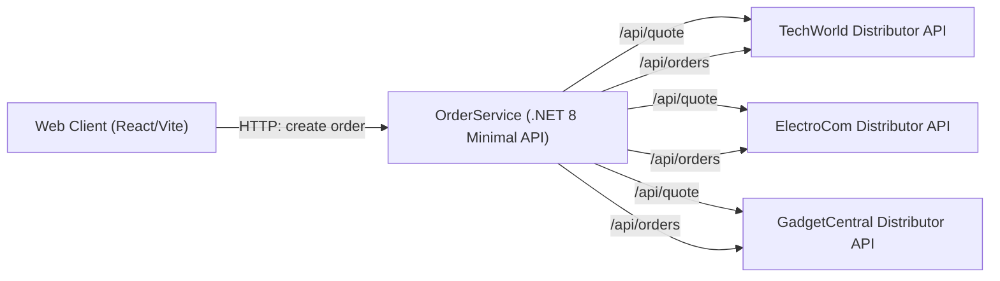
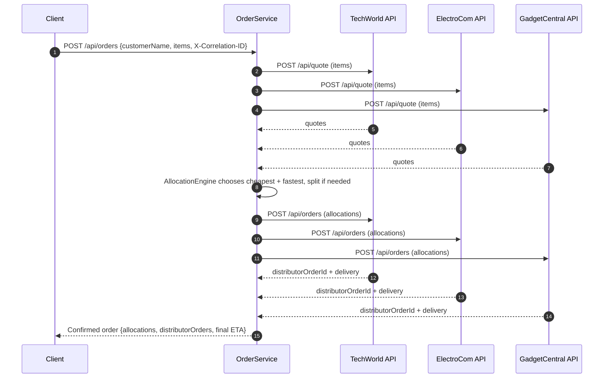

# Architecture

## Component Diagram

```mermaid
flowchart LR
    Client["Web Client (React/Vite)"]
    OrderService["OrderService (.NET 8 Minimal API)"]
    TechWorld["TechWorld Distributor API"]
    ElectroCom["ElectroCom Distributor API"]
    GadgetCentral["GadgetCentral Distributor API"]

    Client -->|HTTP: create order| OrderService
    OrderService -->|/api/quote| TechWorld
    OrderService -->|/api/quote| ElectroCom
    OrderService -->|/api/quote| GadgetCentral
    OrderService -->|/api/orders| TechWorld
    OrderService -->|/api/orders| ElectroCom
    OrderService -->|/api/orders| GadgetCentral
```

## Sequence Diagram (Place Order)

```mermaid
sequenceDiagram
    autonumber
    participant C as Client
    participant O as OrderService
    participant T as TechWorld API
    participant E as ElectroCom API
    participant G as GadgetCentral API

    C->>O: POST /api/orders {customerName, items, X-Correlation-ID}
    O->>T: POST /api/quote (items)
    O->>E: POST /api/quote (items)
    O->>G: POST /api/quote (items)
    T-->>O: quotes
    E-->>O: quotes
    G-->>O: quotes
    O->>O: AllocationEngine chooses cheapest + fastest, split if needed
    O->>T: POST /api/orders (allocations)
    O->>E: POST /api/orders (allocations)
    O->>G: POST /api/orders (allocations)
    T-->>O: distributorOrderId + delivery
    E-->>O: distributorOrderId + delivery
    G-->>O: distributorOrderId + delivery
    O-->>C: Confirmed order {allocations, distributorOrders, final ETA}
```
